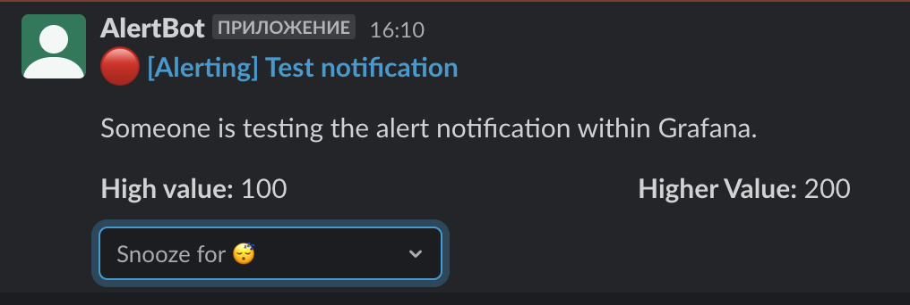

alert-manager
=============

alert-manager is a simple Grafana alert manager. It is allows you to snooze alerts for
a specified period of time from a Slack channel.

Table of contents:

- [How it works](#how-it-works)
- [How to use](#how-to-use)
- [Deploy](#deploy)


## How it works


The alert-manager is a simple Slack bot (web application) that receives alert requests
from Grafana, filters them if necessary, and sends them to Slack.

There are two filter backends:
- in-memory
- redis

The backend determines where information about muted alerts will be stored. In production,
it is recommended to use the redis filter backend.

> **Note:** Only [legacy grafana alerts](https://grafana.com/docs/grafana/latest/alerting/legacy-alerting-deprecation/)
> are currently supported.


## How to use

1. Deploy the `alert-manager` to your server.
2. [Create](https://api.slack.com/apps) a Slack app.
3. Enable Socket Mode in the app settings `Settings` -> `Socket Mode`.
4. Go to `Features` -> `App Manifest` page. Copy the manifest below, paste it into the
   text field, fill in values in the <> brackets, and click "Save Changes".
    ```yaml
    display_information:
      name: <GrafanaAlertBot>
    features:
      bot_user:
        display_name: <GrafanaAlertBot>
        always_online: false
    oauth_config:
      scopes:
        bot:
          - chat:write
    settings:
      interactivity:
        is_enabled: true
      org_deploy_enabled: false
      socket_mode_enabled: true
      token_rotation_enabled: false
    ```
5. Install the app to your workspace.
6. Create a new Slack channel for alerts.
7. Add your app to the channel.
8. Create `Notification Channel` in Grafana with type `webhook` and url
   `<alert-manager-host>/slack/webhook/?channel=<target-channel-name>`. 
   Done! Now you can send a test alert by pressing the 'Test' button. In 
   the Slack channel, you should see a message like this:
   


## Deploy

**docker-compose**

1. Create a .env file with the necessary environment variables.
   An example of an `.env` file can be found in `.env.example`.
2. Copy `docker-compose.yml`.
3. Start the service and its dependencies.
   ```
   docker compose up
   ```
