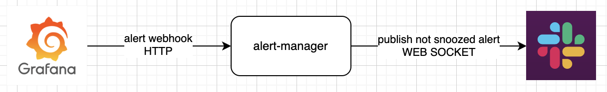
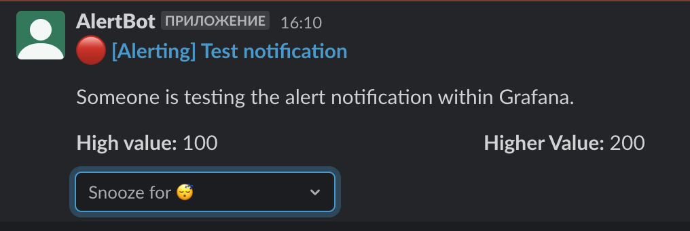
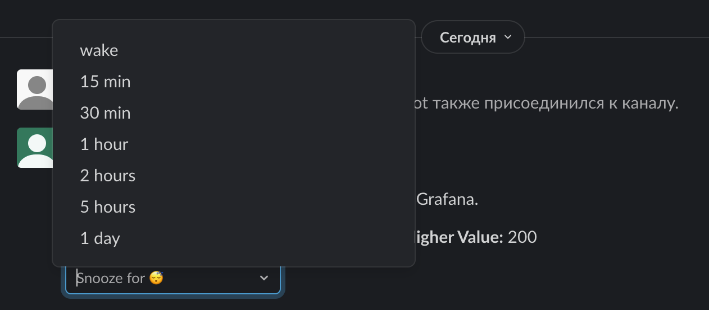
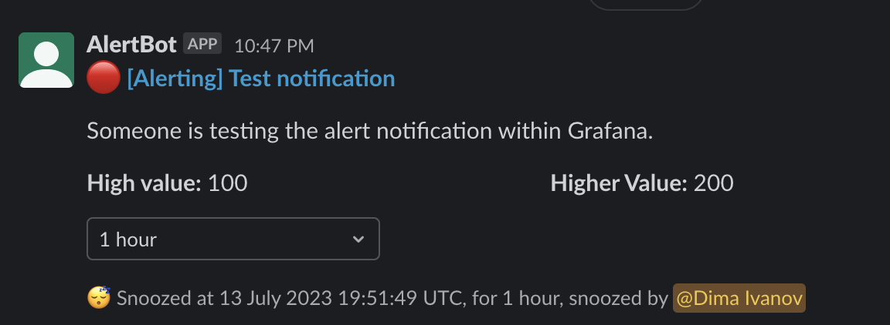
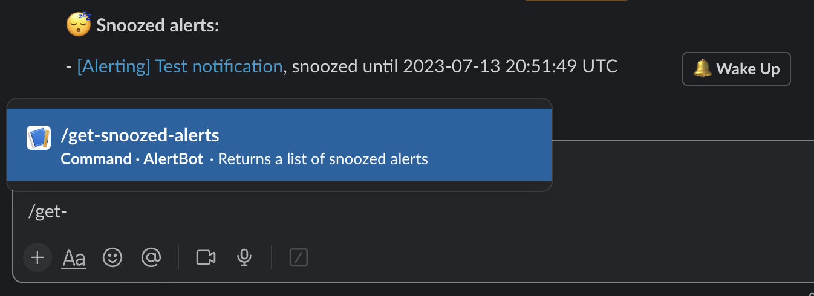

 [](https://github.com/aleksey925/alert-manager/pkgs/container/alert-manager) [](https://github.com/aleksey925/alert-manager/actions/workflows/release.yml)

alert-manager
=============

alert-manager is a simple Grafana alert manager. It is allows you to snooze alerts for
a specified period of time from a Slack channel.

Table of contents:

- [How it works](#how-it-works)
- [How to use](#how-to-use)
  - [Vault](#vault)
  - [Monitoring](#monitoring)
- [Deploy](#deploy)
- [Develop](#develop)
  - [Debug](#debug)


## How it works



The alert-manager is a simple Slack bot (web application) that receives alert requests
from Grafana, filters them if necessary, and sends them to Slack.

There are two filter backends:
- in-memory
- redis

The backend determines where information about muted alerts will be stored. In production,
it is recommended to use the redis filter backend.

> **Note:** Only [legacy grafana alerts](https://grafana.com/docs/grafana/latest/alerting/legacy-alerting-deprecation/)
> are currently supported.


## How to use

1. Deploy the `alert-manager` to your server.
2. [Create](https://api.slack.com/apps) a Slack app.
3. Enable Socket Mode in the app settings `Settings` -> `Socket Mode`.
4. Go to `Features` -> `App Manifest` page. Copy the manifest below, paste it into the
   text field, fill in values in the <> brackets, and click "Save Changes".
    ```yaml
    display_information:
      name: <GrafanaAlertBot>
    features:
      bot_user:
        display_name: <GrafanaAlertBot>
        always_online: false
      slash_commands:
        - command: /get-snoozed-alerts
          description: Returns a list of snoozed alerts
          should_escape: false
    oauth_config:
      scopes:
        bot:
          - chat:write
          - commands
          - incoming-webhook
    settings:
      interactivity:
        is_enabled: true
      org_deploy_enabled: false
      socket_mode_enabled: true
      token_rotation_enabled: false
    ```
5. Install the app to your workspace.
6. Create a new Slack channel for alerts.
7. Add your app to the channel.
8. Create `Notification Channel` in Grafana with type `webhook` and url
   `<alert-manager-host>/slack/webhook/?channel=<target-channel-name>`.

   > **Channel identification**
   >
   > The channel identification mode is controlled by the `USE_CHANNEL_ID` environment variable:
   >
   > **`USE_CHANNEL_ID=false` (default)**
   > - Use `channel` query parameter with channel name (e.g., `?channel=alerts`)
   >   - Simple setup, works with public channels
   >   - **Limitation**: snooze will not work for private channels (Slack returns `privategroup` instead of actual channel name)
   >
   > **`USE_CHANNEL_ID=true`**
   > - Use `channel_id` query parameter with Slack channel ID (e.g., `?channel_id=C1234567890`)
   >   - Works correctly with both public and private channels
   >   - To get the channel ID: right-click on the channel in Slack → "View channel details" → the Channel ID is shown at the bottom of the popup

   Done! Now you can send a test alert by pressing the 'Test' button. In
   the Slack channel, you should see a message like this:

   
   
   
   


### Vault

Alert-manager supports storage integration by default. You can enable this
feature through the following environment variables (If you want to use other authentication
methods, you need to use the appropriate environment variables. This example shows the
configuration for authorization using vault token.):

- `VAULT_ADDR` is the url of the vault. Example: `http://127.0.0.1:8200`
- `VAULT_TOKEN` is token for accessing to vault. Example: `s.1234567890`
- `VAULT_SECRET_PATH` is the full path (with mount point included) to the secret. Example: `secret/data/alert-manager`

[Here](https://github.com/nymous/pydantic-vault#authentication) you can find all
possible authorization methods.

The application allows you to store the following settings in vault (the name of
these settings corresponds to the name of the key in the secret of the vault):

- accounts
- slack_token
- slack_socket_mode_token
- redis_url
- redis_ssl_ca_certs
- redis_ssl_client_cert
- redis_ssl_client_key
- redis_ssl_check_hostname


### Monitoring

Now there are two approaches to monitoring the alert-manager:

- Sentry (If you have a Sentry instance, simply add the `SENTRY_DSN` environment
  variable. All available environment variables can be found in the `.env.example` file.)
- `/health-check/` endpoint


## Deploy

**docker-compose**

1. Create a .env file with the necessary environment variables.
   An example of an `.env` file can be found in `.env.example`.
2. Copy `docker-compose.yml`.
3. Start the service and its dependencies.
   ```
   docker compose up
   ```


## Develop

### Debug

If you want to debug an application and need to provide global access to a locally running
application, you can use ngrok.

You can do it with the following command:

```
ngrok http 8080
```

Test curl request for sending an alert:

```bash
# Default mode (USE_CHANNEL_ID=false) - use channel name
curl -X POST 'http://localhost:8000/webhook/grafana/?channel=alerts' \
    -H 'Content-Type: application/json' \
    -d '{
      "title": "[Alerting] Test Alert",
      "ruleName": "Test Alert",
      "state": "alerting",
      "ruleUrl": "http://localhost:3000/d/test/dashboard?viewPanel=1",
      "message": "This is a test alert message",
      "evalMatches": [
        {
          "value": 100,
          "metric": "test_metric",
          "tags": {
            "instance": "app:8000",
            "job": "test_job"
          }
        }
      ]
    }'

# With USE_CHANNEL_ID=true - use channel ID
curl -X POST 'http://localhost:8000/webhook/grafana/?channel_id=C1234567890' \
    -H 'Content-Type: application/json' \
    -d '{ ... }'
```
